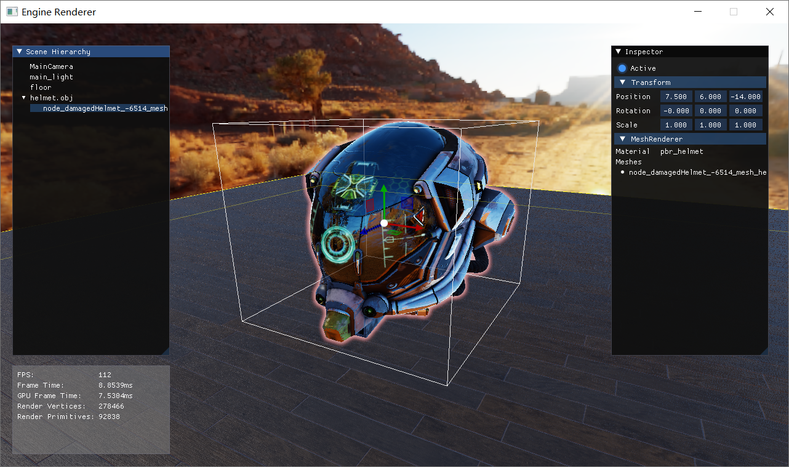
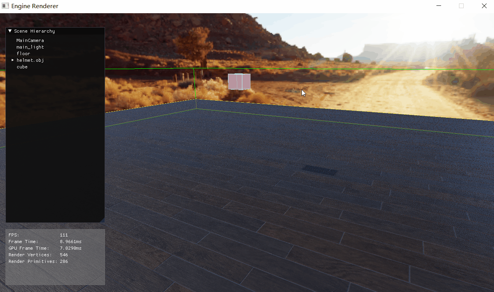
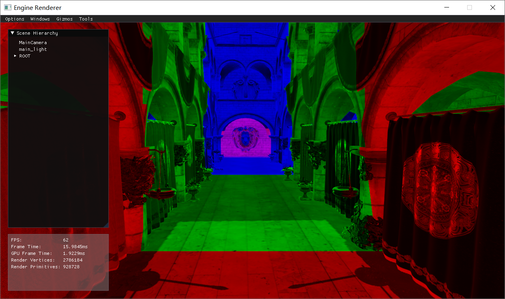
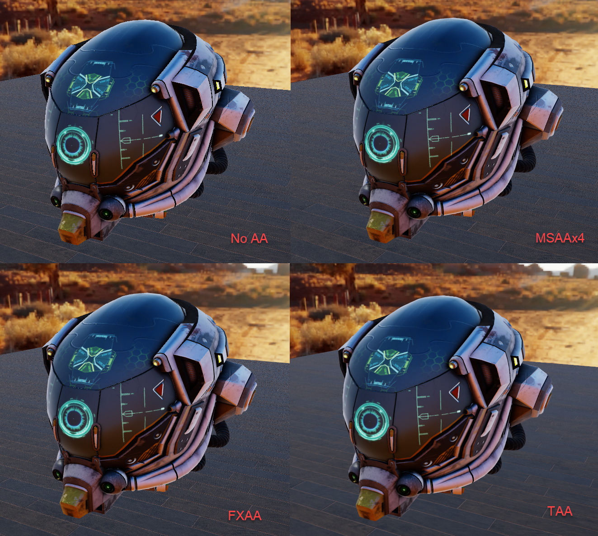
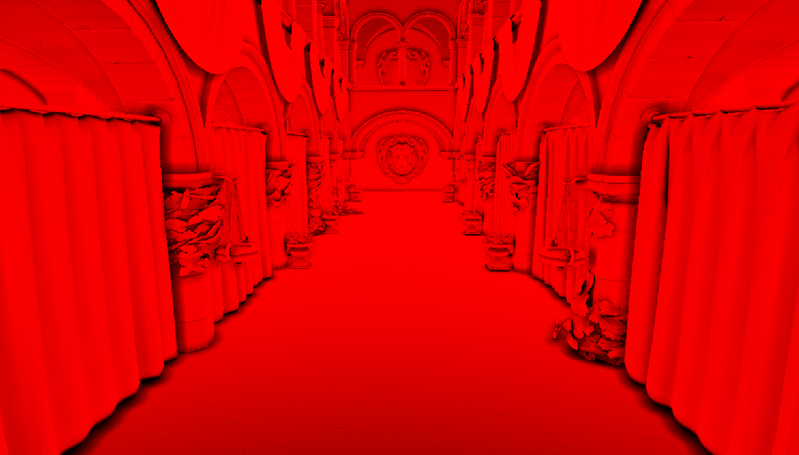
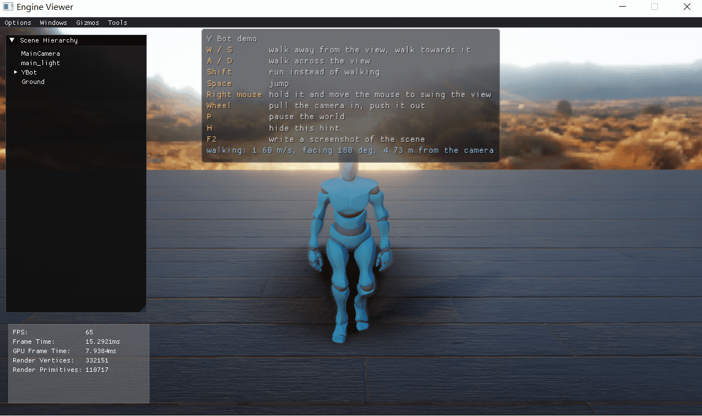

# Glacier

A personal toy game engine project based on ~~D3D11 &~~ D3D12

## Prerequistes
* Visual Studio 2026 with C++20 support
* Windows 10
* CMake 3.21 or newer
* vcpkg with `VCPKG_ROOT` configured

The renderer uses the C++20 `<format>` standard library interface; no separate
fmt dependency is required.

## Build with CMake

Configure the x64 Visual Studio project from the repository root:

```powershell
cmake -S . -B build/cmake -G "Visual Studio 18 2026" -A x64
```

The build machine must have vcpkg installed and `VCPKG_ROOT` set. CMake uses
that toolchain and installs the DirectXTex, DirectXTK, and assimp dependencies
declared in `vcpkg.json`.

Build either configuration:

```powershell
cmake --build build/cmake --config Debug --target renderer
cmake --build build/cmake --config Release --target renderer
```

The executable is written to `bin/Debug` or `bin/Release`. CMake defaults to
the `x64-windows-static` vcpkg triplet, so these dependencies do not require
runtime DLL deployment. From the repository root, run either configuration:

```powershell
..\bin\Debug\renderer.exe
```

Use `..\bin\Release\renderer.exe` for the Release build. The application
automatically locates the `renderer` resource directory for scripts, assets,
and runtime-compiled shaders.

## Features

* ~~D3D11 &~~ D3D12 backend
* Forward & Deferred Rendering
* PBR & IBL
* HDR/linear lighting
* Cascaded Shadow Map
* MSAA & FXAA & TAA
* GTAO
* Rigidbody Physics
* Component-Based Architecture
* Fiber-based Job System
* Editor & Gizmo
* Input System
* Lua Binding Framework
* GPU skinning & instanced skinning draws
* Animation System

## Example

**PBR**


**Physics**


**Cascaded Shadow Map**


**Anti-Aliasing**


**GTAO**


**Animation**
