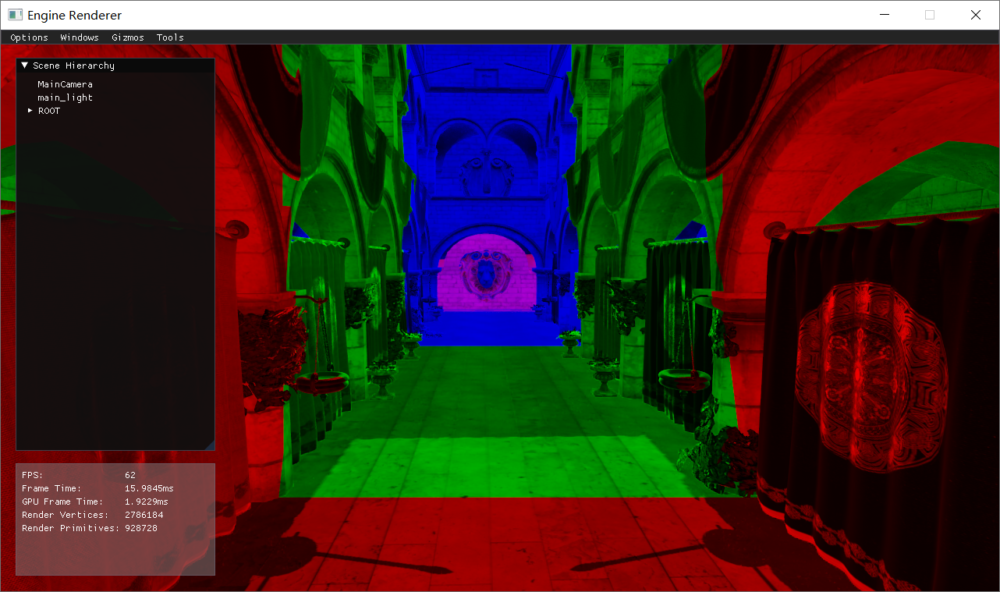
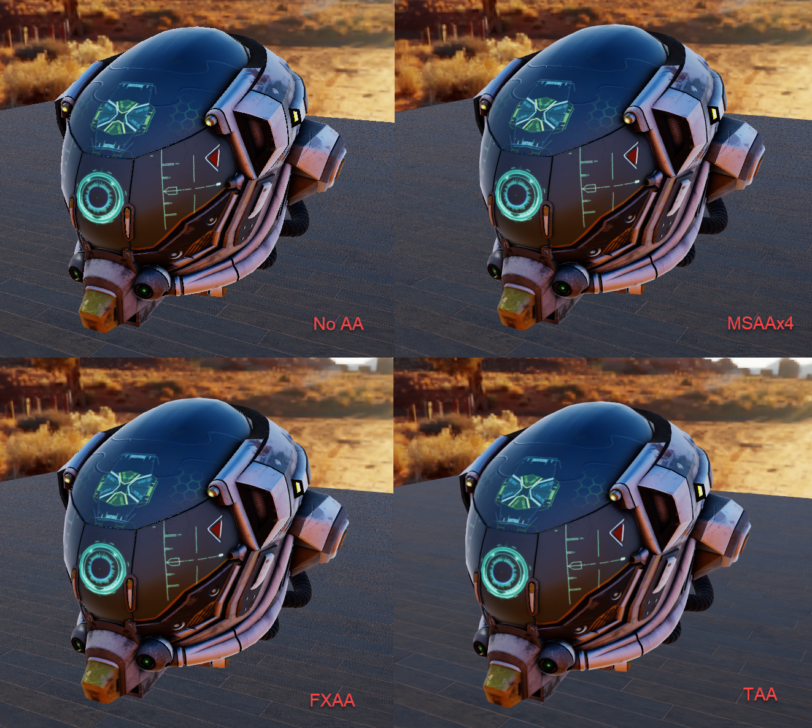
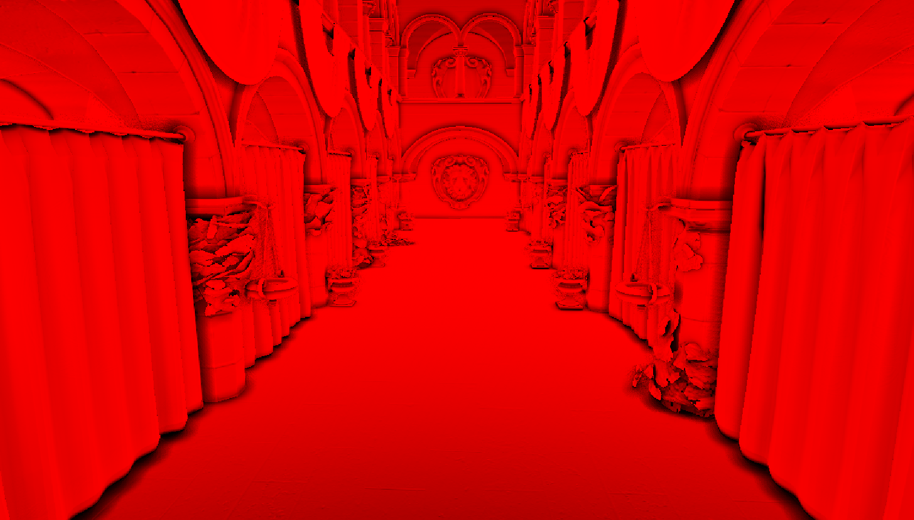

# Glacier

A personal toy game engine project based on ~~D3D11 &~~ D3D12

## Prerequistes
* Visual Studio 2019
* Windows 10

## Features

* ~~D3D11 &~~ D3D12 backend
* Forward & Deferred Rendering
* PBR & IBL
* HDR/linear lighting
* Cascaded Shadow Map
* MSAA & FXAA & TAA
* Rigidbody Physics
* Component-Based Architecture
* Fiber-based Job System
* Editor & Gizmo
* Input System

## Example

**PBR**

**Physics**

**Cascaded Shadow Map**

**Anti-Aliasing**

**GTAO**
